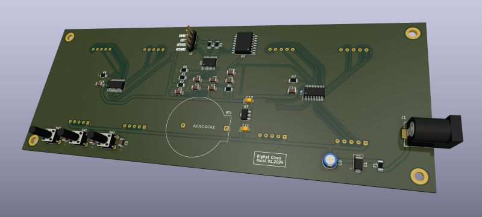

# Digital Clock

Jednoduché digitální hodiny ze čtyř 7mi segmentových displejů.

#### Funkce tlačítek (z boku):
1. tlačítko - zapne nastavování hodin
2. tlačítko - přepíná hodiny nebo minuty nahoru
3. tlačítko - přepíná hodiny nebo minuty dolů

## Další fotky

